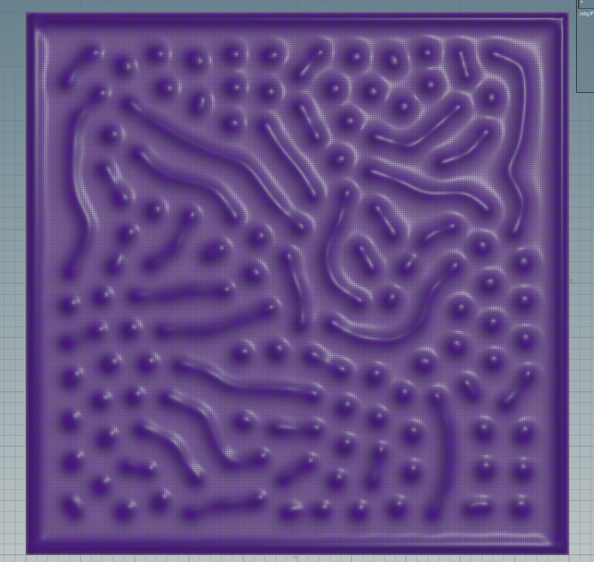
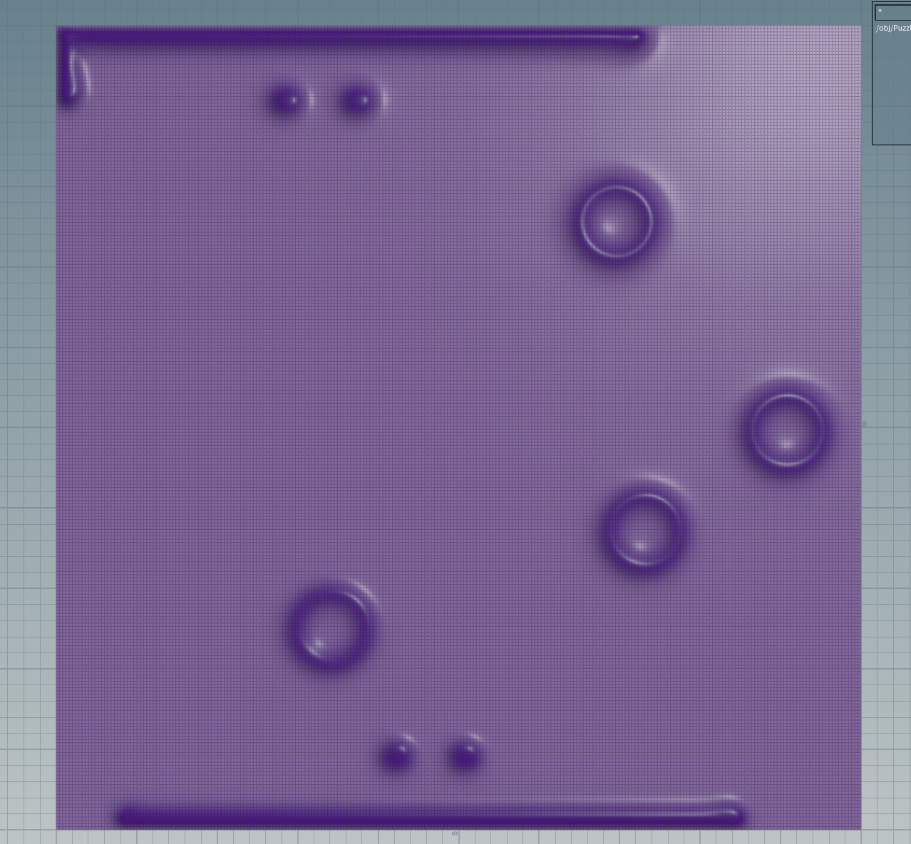
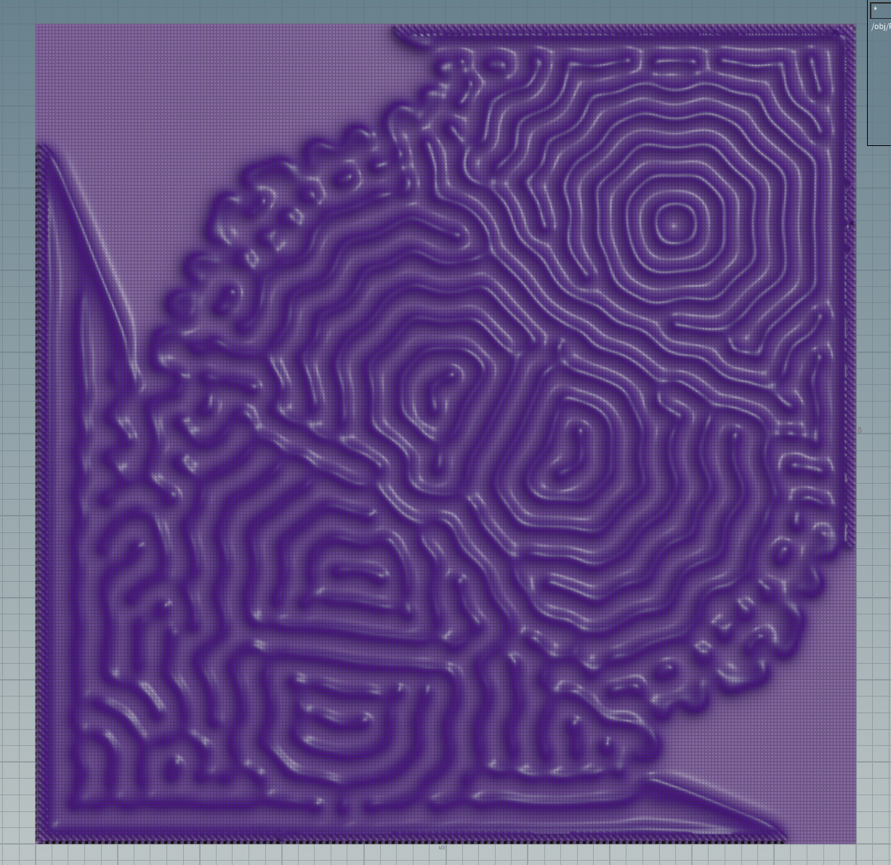
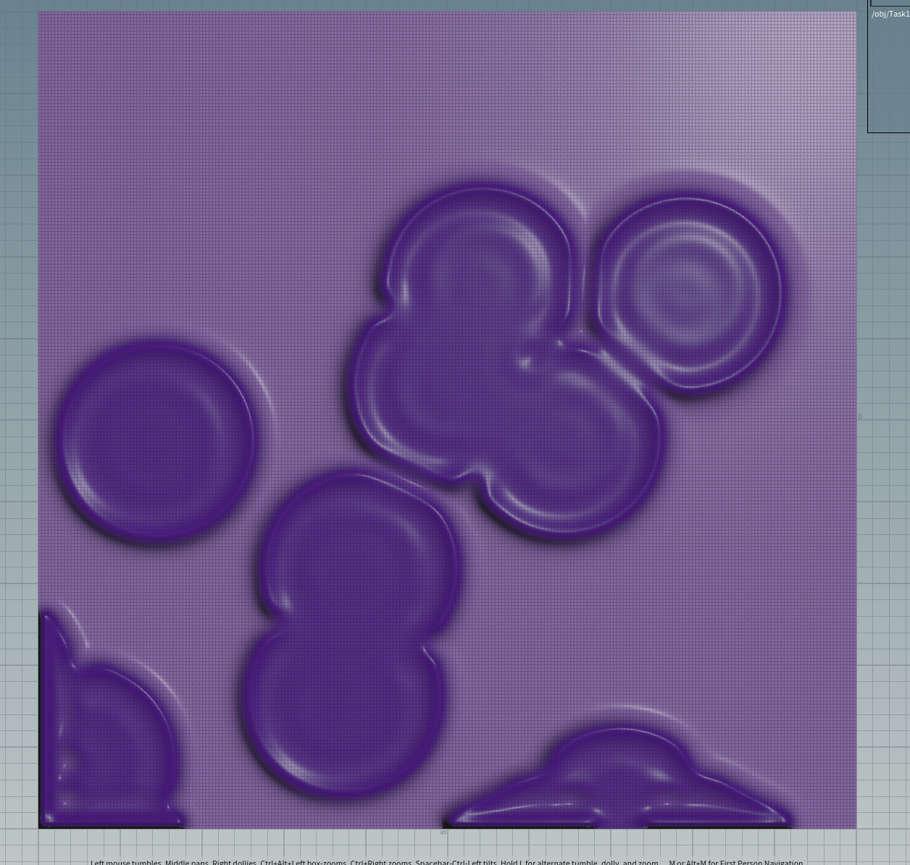
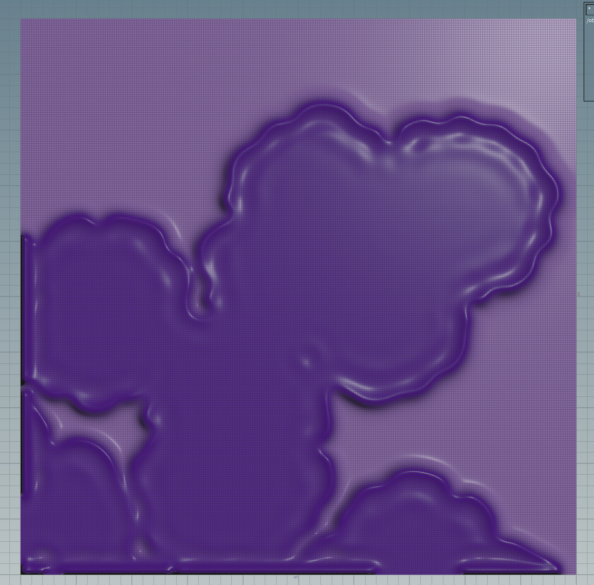

# Lab06 - Reaction Diffusion
Wayne Wu

# Puzzle 1

Feed rate = 0.03

# Puzzle 2

Kill rate = 0.0655

# Puzzle 3

D_B = 0.25

Seed Placement

# Task 1

Noise can be added inside the Make_Circle VEX code to get more interesting initial conditions.

Without noise 

With noise

# Task 2

Added a torus as the initial shape and using the same settings as Puzzle 3 to get concentric rings.

